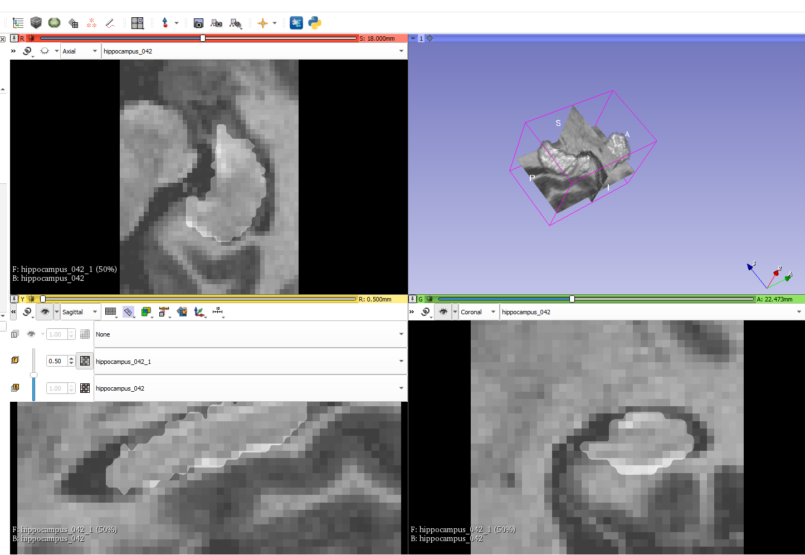

# Udacity - AI for Healthcare Nanodegree Program

Learn to build, evaluate, and integrate predictive models that have the power to transform
patient outcomes. Begin by classifying and segmenting 2D and 3D medical images to augment diagnosis
and then move on to modeling patient outcomes with electronic health records to optimize clinical trial
testing decisions. Finally, build an algorithm that uses data collected from wearable devices to estimate the
wearer’s pulse rate in the presence of motion

## Applying AI to 2D Medical Imaging Data

Learn the fundamental skills needed to work with 2D medical imaging data and how to use AI to derive clinically-relevant insights from data gathered via different types of 2D medical imaging such as x-ray, mammography, and digital pathology. Extract 2D images from DICOM files and apply the appropriate tools to perform exploratory data analysis on them. Build different AI models for different clinical scenarios that involve 2D images and learn how to position AI tools for regulatory approval.

### Project: [Pneumonia Detection from Chest X-Rays](https://github.com/piushvaish/aiforhealthcare/tree/master/Project1)

In this project, you will analyze data from the NIH Chest X-ray dataset and train a CNN to classify a given chest X-ray for the presence or absence of pneumonia. First, you’ll curate training and testing sets that are appropriate for the clinical question at hand from a large collection of medical images. Then, you will create a pipeline to extract images from DICOM files that can be fed into the CNN for model training. Lastly, you’ll write an FDA 501(k) validation plan that formally describes your model, the data that it was trained on, and a validation plan that meets FDA criteria in order to obtain clearance of the software being used as a medical device.

## Applying AI to 3D Medical Imaging Data
Learn the fundamental skills needed to work with 3D medical imaging datasets and frame insights derived from the data in a clinically relevant context. Understand how these images are acquired, stored in clinical archives, and subsequently read and analyzed. Discover how clinicians use 3D medical images in practice and where AI holds most potential in their work with these images. Design and apply machine learning algorithms to solve the challenging problems in 3D medical imaging and how to integrate the algorithms into the clinical workflow.

### Project: [Hippocampus Volume Quantification for Alzheimer's Progression](https://github.com/piushvaish/aiforhealthcare/tree/master/Project2)

Hippocampus is one of the major structures of the human brain with functions that are primarily connected to learning and memory. The volume of the hippocampus may change over time, with age, or as a result of disease. In order to measure hippocampal volume, a 3D imaging technique with good soft tissue contrast is required. MRI provides such imaging characteristics, but manual volume measurement still requires careful and time consuming delineation of the hippocampal boundary. In this project, you will go through the steps that will have you create an algorithm that will helps clinicians assess hippocampal volume in an automated way and integrate this algorithm into a clinician's working environment.

## Applying AI to EHR Data
Learn the fundamental skills to work with EHR data and build and evaluate compliant, interpretable models. You will cover EHR data privacy and security standards, how to analyze EHR data and avoid common challenges, and cover key industry code sets. By the end of the course, you will have the skills to analyze an EHR dataset, transform it to the right level, build powerful features with TensorFlow, and model the uncertainty and bias with TensorFlow Probability and Aequitas.

### Project: [Patient Selection for Diabetes Drug Testing](https://github.com/piushvaish/aiforhealthcare/tree/master/Project3)

In this project, you are a data scientist for an exciting unicorn healthcare startup that has created a groundbreaking diabetes drug that is ready for clinical trial testing. You will work with real, de-identified EHR data to build a regression model to predict the estimated hospitalization time for a patient and select/filter patients for your study.

## Applying AI to Wearable Device Data
Learn how to build algorithms that process the data collected by wearable devices and surface insights about the wearer’s health. Cover the sensors and signal processing foundation that are critical for success in this domain, including IMU, PPG, and ECG that are common to most wearable devices, and learn how to build three algorithms from real-world sensor data.

### Project: [Motion Compensated Pulse Rate Estimation](https://github.com/piushvaish/aiforhealthcare/tree/master/Project4)

Wearable devices have multiple sensors all collecting information about the same person at the same time. Combining these data streams allows us to accomplish many tasks that would be impossible from a single sensor. In this project, you will build an algorithm that combines information from two of the sensors that are covered in this course -- the IMU and PPG sensors -- to build an algorithm that can estimate the wearer’s pulse rate in the presence of motion. By only providing necessary background information and minimal starter code, this project puts you in the same position as a data scientist working for a wearable device company. You will have to rely on your knowledge of the sensors, the techniques that you have learned in this course, and your own creativity to design and implement an algorithm that accomplishes the task set out for you.
